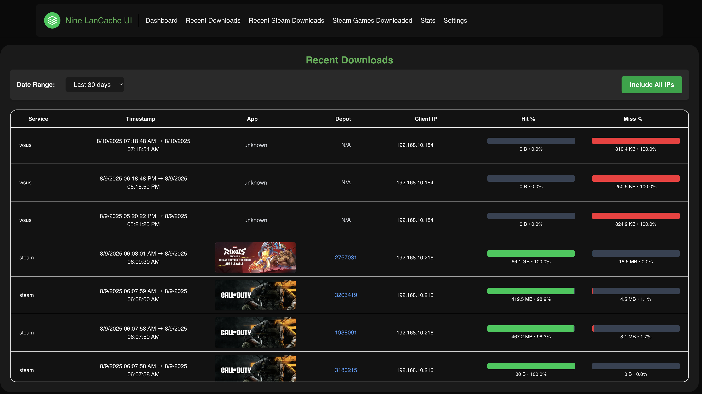
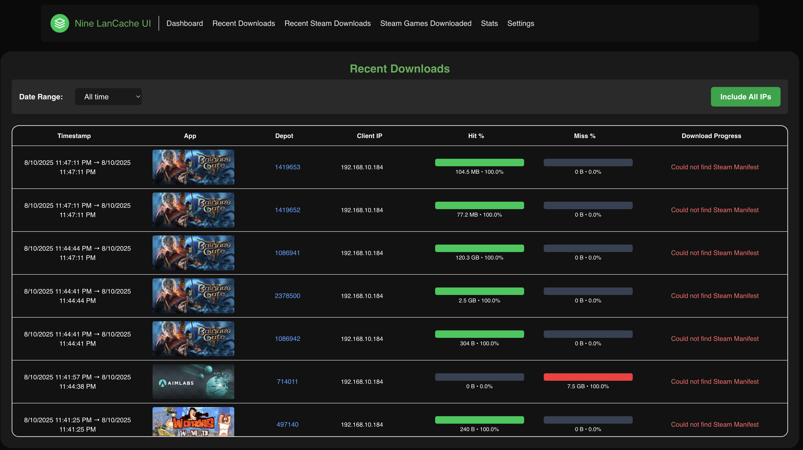
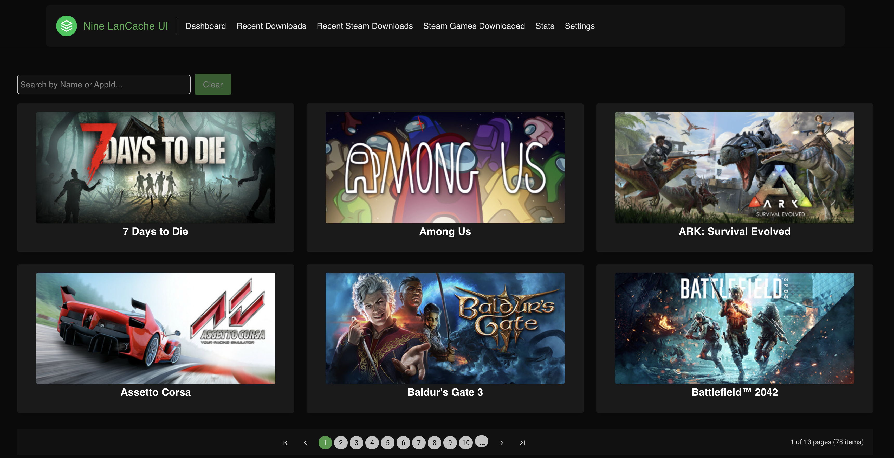
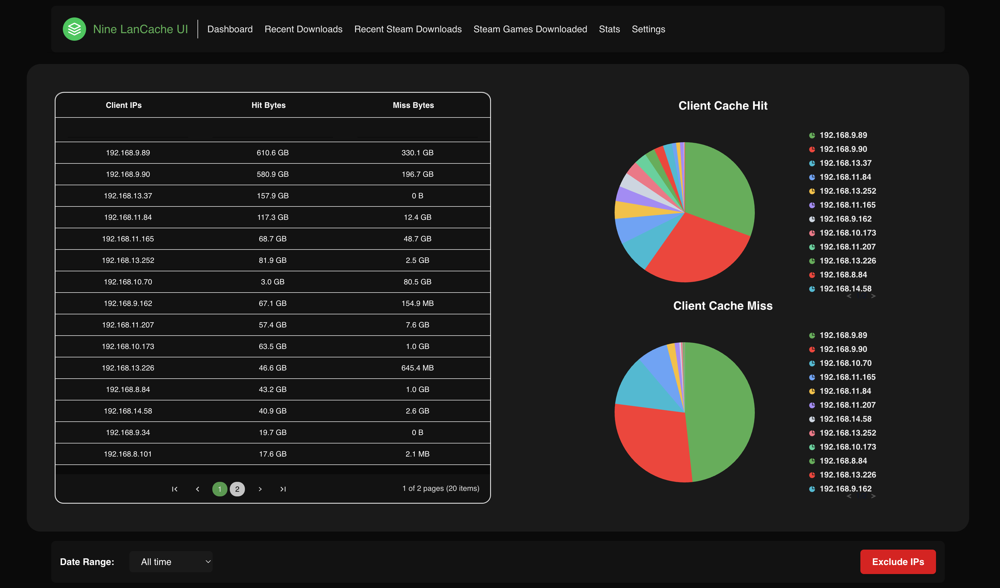
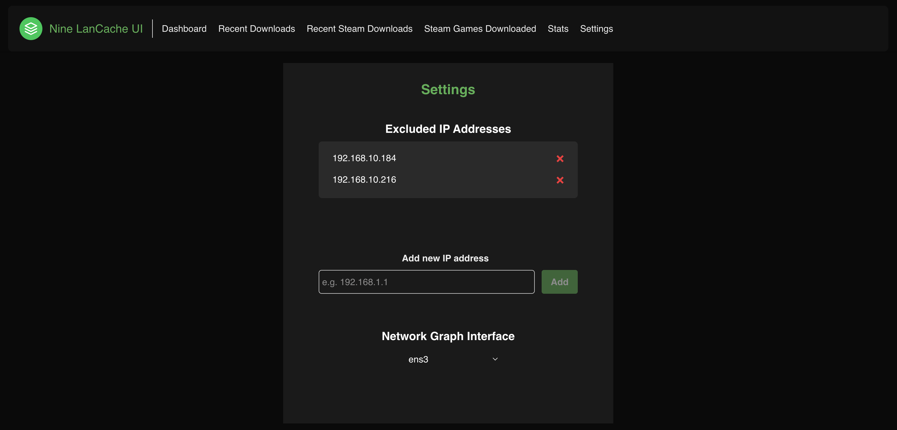
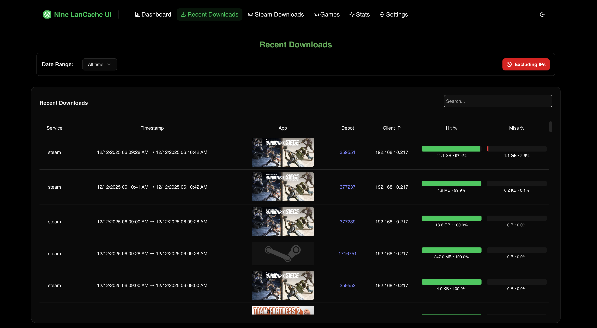
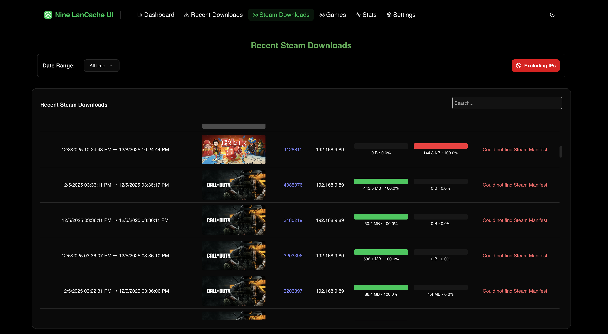
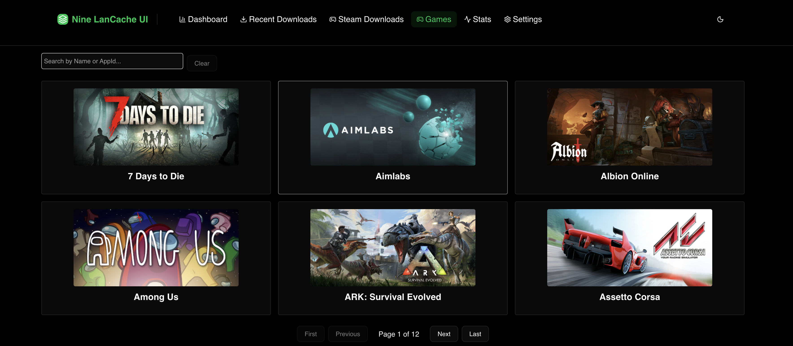
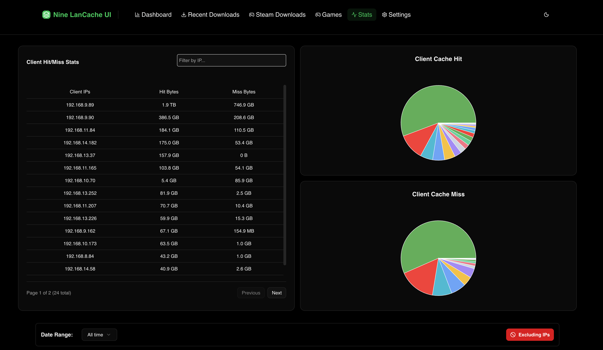
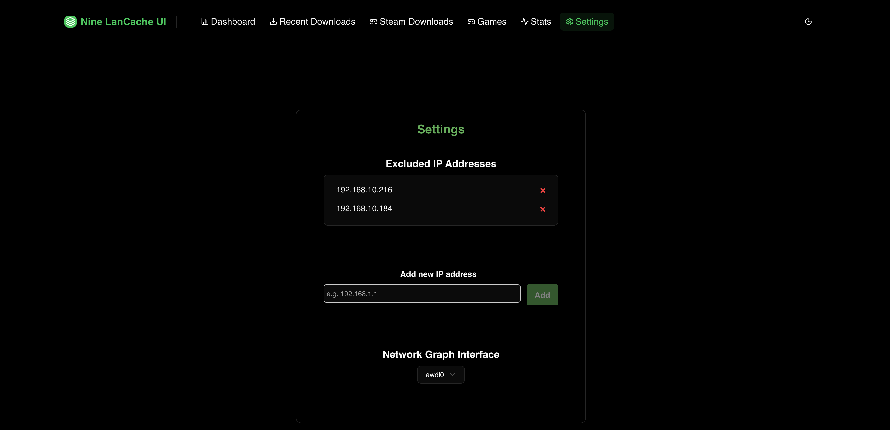

# NineLanCacheUI

[](https://opensource.org/licenses/MIT)
[](https://github.com/NinePiece2/NineLanCacheUI/actions/workflows/build-ui.yml)
[](https://github.com/NinePiece2/NineLanCacheUI/actions/workflows/build-api.yml)
[](https://hub.docker.com/r/ninepiece2/nine-lancache-ui)
[](CONTRIBUTING.md)

## Table Of Contents
- [NineLanCacheUI](#ninelancacheui)
  - [Table Of Contents](#table-of-contents)
  - [Introduction](#introduction)
  - [Screenshots](#screenshots)
  - [Install/Run Instructions](#installrun-instructions)
    - [Versions \& Docker Images](#versions--docker-images)
    - [Docker Compose File:](#docker-compose-file)
    - [Configuration variable explanation](#configuration-variable-explanation)
  - [Contributing](#contributing)
  - [Troubleshooting](#troubleshooting)
    - [Issue: My access.log file is updated but the backend isn't reading the new lines](#issue-my-accesslog-file-is-updated-but-the-backend-isnt-reading-the-new-lines)
  - [License](#license)
  - [References:](#references)


## Introduction

Based on [DeveLanCacheUI_Backend](https://github.com/devedse/DeveLanCacheUI_Backend) / [DeveLanCacheUI_Frontend](https://github.com/devedse/DeveLanCacheUI_Frontend)
Directly forking the DeveLanCacheUI_Backend project and creating a new UI for [LanCache.NET](https://lancache.net/). This is done using Syncfusion grids and pie charts for an improved look and better data filtering and visualization. There are also filters that are perisitant throughout certain pages and through closing and reopening the page that allow for time filtration and showing or hiding excluded IPs.

The Backend/API runs a .NET 9 Web API and the Frontend/UI uses NextJS and Nginx. 

## Screenshots

<details>
<summary>Version 1</summary>

Shows a few statistics about the usage per service:

[](images/v1/Dashboard.png)

Shows a graph for the outbound usage of a given interface (Changable in Settings):

[](images/v1/DashboardSpeed.png)

Shows recent downloads by service:

[](images/v1/RecentDownloads.png)

Shows recent download steam games and their download progress based on manifest size:

[](images/v1/RecentSteamDownloads.png)

Shows all games that have been downloaded through steam:

[](images/v1/AllSteamGames.png)

Shows the hit and miss statistics of every client:

[](images/v1/StatsPage.png)

Shows the settings page where the active interface can be selected for the graph and excluded IPs can be added:

[](images/v1/SettingsPage.png)

</details>

<details open>
<summary>Version 2</summary>

Shows a few statistics about the usage per service:

[](images/v2/Dashboard.png)

Shows a graph for the outbound usage of a given interface (Changable in Settings):

[](images/v2/DashboardSpeed.png)

Shows recent downloads by service:

[](images/v2/RecentDownloads.png)

Shows recent download steam games and their download progress based on manifest size:

[](images/v2/RecentSteamDownloads.png)

Shows all games that have been downloaded through steam:

[](images/v2/AllSteamGames.png)

Shows the hit and miss statistics of every client:

[](images/v2/StatsPage.png)

Shows the settings page where the active interface can be selected for the graph and excluded IPs can be added:

[](images/v2/SettingsPage.png)

</details>

## Install/Run Instructions
1. Create a folder somewhere on the system for the persistant data to be stored. For exmple ```mkdir backendData``` then give it permissions with something like ```chown 777 backendData```.
2. Update the docker-compose.yml volumes to match your LanCache Logs folder and the new persistant data folder
3. Change the Timezone and Lang information to help with debugging inside the container.
4. Change the dns to your LanCache.
5. Run ```docker compose up -d```
6. Visit http://LanCacheIP:NGINX_PORT where LanCacheIP is the machine that is running NineLanCacheUI (In my case http://192.168.15.200:8080).

### Versions & Docker Images

There are two supported UI/API tracks:

- **Version 1 (v1)**: the legacy UI that uses the original Syncfusion UI elements. It is considered the older release and does not receive active feature updates (security/critical fixes may be provided as needed).
- **Version 2 (v2)**: the new UI which uses shadcn/ui and contains the latest improvements and ongoing updates.

Docker image tags you can use (examples):

- `ninepiece2/nine-lancache-ui:ui-1.0` and `ninepiece2/nine-lancache-ui:api-1.0` (stable v1 tags)
- Patch tags for v1: `ui-1.01` / `api-1.01` (if available)
- Beta / newer v2 builds: `ninepiece2/nine-lancache-ui:ui-beta` and `ninepiece2/nine-lancache-ui:api-beta`
- There are also `ui` / `api` tags that may point to the current default image on Docker Hub (check the repository tags to confirm which version they currently reference).

Where the images are published:

- v1 images are available on Docker Hub.
- v2 images are published on Docker Hub and the GitHub Container Registry (GHCR) — check the repository tags/pages for the exact image name and tag.

Change which image you run by editing the `image:` lines in your `docker-compose.yml`. Example (replace the tag with the one you want):

```yml
  ui:
    image: ninepiece2/nine-lancache-ui:ui-1.01
  api:
    image: ninepiece2/nine-lancache-ui:api-1.01
```

### Docker Compose File:

docker-compose.yml:
```yml
services:
  api:
    image: ninepiece2/nine-lancache-ui:api
    restart: unless-stopped
    network_mode: "host"
    environment:
      - LanCacheLogsDirectory=/var/ninelancacheui/lancachelogs
      - LanCacheUIDataDirectory=/var/ninelancacheuidata
      - ConnectionStrings__DefaultConnection=Data Source={LanCacheUIDataDirectory}/database/nine-lancache-ui.db;
      - TZ=America/Toronto
      - ASPNETCORE_ENVIRONMENT=Production
      - LANG=en_CA.UTF-8
      - DirectSteamIntegration=false
      - SkipLinesBasedOnBytesRead=false
      - ASPNETCORE_HTTP_PORTS=7401
    volumes:
      - "/home/romit/NineLanCacheUI/backendData:/var/ninelancacheuidata"
      - "/mnt/NvmeSSD/LanCacheData/logs:/var/ninelancacheui/lancachelogs:ro"
    dns:
      - 192.168.15.200
    logging:
      driver: json-file
      options:
        max-size: "10m"
        max-file: "2"
  ui:
    image: ninepiece2/nine-lancache-ui:ui
    restart: unless-stopped
    network_mode: "host"
    environment:
      - API_BASE_URL=http://localhost:7401
      - API_PORT=7401
      - NGINX_PORT=8080 # output port (where you access the site)
      - AllowedHosts=*
```

### Configuration variable explanation

**Environment Variables API**

| Variable  | Explanation | Default | 
| -- | -- | -- |
| LanCacheLogsDirectory | The internal folder inside the container the backend tries to look for the lancache log files. Ideally don't touch this. | /var/ninelancacheui/lancachelogs |
| LanCacheUIDataDirectory | The internal folder inside the container the backend stores all it's data. Ideally don't touch this. | /var/ninelancacheuidata |
| ConnectionStrings__DefaultConnection | The connection string used with SQLite. Ideally don't touch this. | Data Source={LanCacheUIDataDirectory}/database/nine-lancache-ui.db; |
| TZ | Set this to your timezone | ?? |
| LANG | Set this to your language | ?? |
| DirectSteamIntegration | When false, the backend will download a .CSV file with all depot => steam game mappings (from: https://github.com/devedse/DeveLanCacheUI_SteamDepotFinder_Runner/releases). When true, the tool wil generate this itself / keep it up to date. I would suggest turning this on. | false (for now) |
| SkipLinesBasedOnBytesRead | When false, it will re-read through the whole file on startup. When true, it tries to be smart and start reading from where it last left off. I would suggest turning this on. | false (for now) |

**Volume Mounts API**

| Path  | Explanation | 
| -- | -- |
| - "/home/romit/NineLanCacheUI/backendData:/var/ninelancacheuidata" | Change the part before the `:` to an empty data directory |
| - "/mnt/NvmeSSD/LanCacheData/logs:/var/ninelancacheui/lancachelogs:ro" | Change the part before the `:` to the log directory for lancache |

**Environment Variables UI**

| Variable  | Explanation | Default | 
| -- | -- | -- |
| AllowedHosts | Sets the HOSTS header for CORS. Leave at * unless you know what you're doing | * |
| API_BASE_URL | The backend url where the frontend connects to. | http://localhost:7401 |
| API_PORT | The backend port where the frontend connects to in nginx. | 7401 |
| NGINX_PORT | The output port (where you access the site) | 8080 |

## Contributing

We welcome contributions from the community! Please check out our [Contributing Guidelines](CONTRIBUTING.md) to get started.

- 🐛 [Report a Bug](https://github.com/NinePiece2/NineLanCacheUI/issues/new?template=bug_report.md)
- ✨ [Request a Feature](https://github.com/NinePiece2/NineLanCacheUI/issues/new?template=feature_request.md)
- 💬 [Ask a Question](https://github.com/NinePiece2/NineLanCacheUI/issues/new?template=question.md)
- 📖 [Read the Code of Conduct](CODE_OF_CONDUCT.md)

## Troubleshooting

### Issue: My access.log file is updated but the backend isn't reading the new lines

If the access.log file is in a SMB Share which is mounted in docker, the application may take a READ lock on the share. This lets CIFS decide that no other applications will write to this file, allowing it to cache things.

**Solution:** You need to add `cache=none` to the CIFS mount in `/etc/fstab`:
```
//192.168.2.201/DockerComposers /mnt/mynas/DockerComposers cifs credentials=/home/pi/.mynascredentialssmb,iocharset=utf8,vers=3.0,sec=ntlmssp,cache=none 0 0
```

If you manually execute the `ls` command in the lancachelogs directory it will also start reading the file again temporarily.

For more issues and solutions, check our [Issues page](https://github.com/NinePiece2/NineLanCacheUI/issues).

## License

This project is licensed under the MIT License - see the [LICENSE](LICENSE) file for details.

## References:
- https://github.com/devedse/DeveLanCacheUI_Backend?tab=readme-ov-file